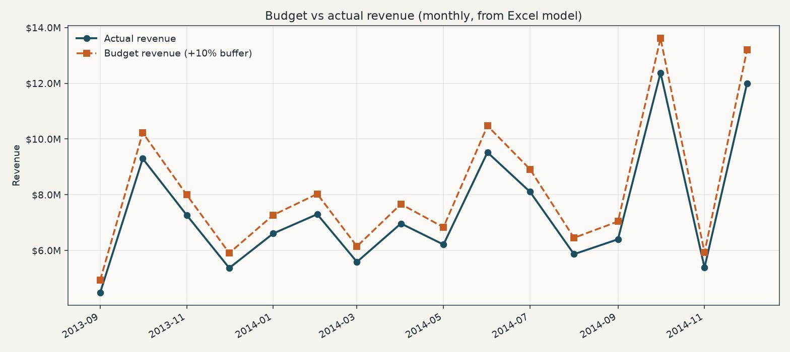
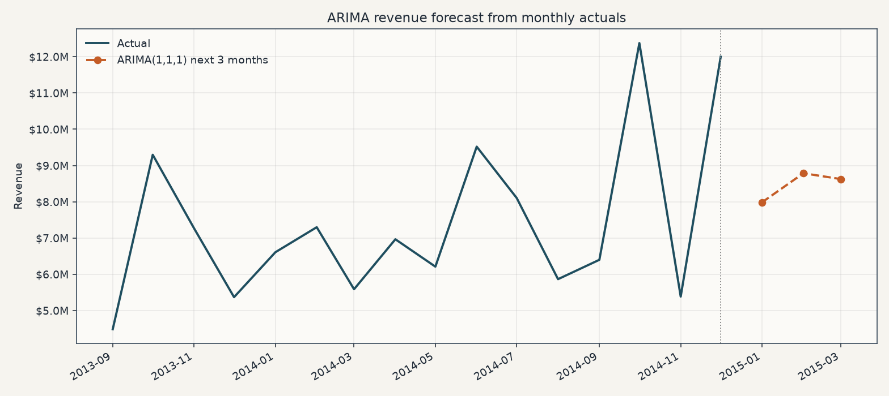
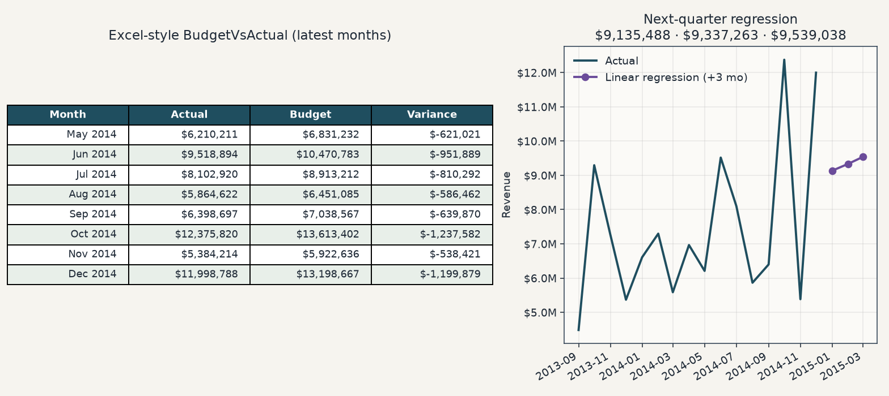
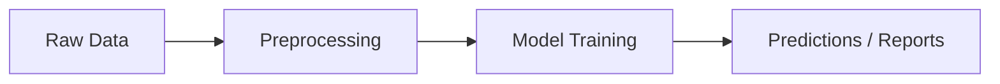

# Financial Forecasting Model 📊

[](https://www.python.org/)
[](https://www.microsoft.com/microsoft-365/excel)
[](https://powerbi.microsoft.com/)
[](https://scikit-learn.org/)
[](https://www.statsmodels.org/)

Budget vs actual tracking and illustrative revenue forecasts in Excel, Power BI, and Python (linear regression and ARIMA).

**Homepage:** this README (no separate live demo).

## Gallery

Charts below are generated from `models/financial_forecast_model.xlsx` (the `BudgetVsActual` sheet).







Refresh the PNGs after changing the workbook:

```bash
pip install -r requirements.txt
python docs/screenshots/render_gallery.py
```

## Features

- Budget vs actual tracking
- Visualizations in Excel and Plotly
- Regression and ARIMA forecasting

## Project structure

- `/data` — raw financial CSV
- `/models` — Excel forecasting workbook
- `/scripts` — Python analysis and visualization
- `/powerbi` — Power BI template (placeholder)
- `/docs/screenshots` — README gallery outputs

## How to use

1. `pip install -r requirements.txt`
2. Run `scripts/scaffold.py` to prepare Excel models.
3. Use `scripts/regression_predictor.py` for basic regression.
4. Use `scripts/advanced_forecast_arima.py` for the ARIMA example.
5. Visualize with `scripts/visualizations.py` or Excel/Power BI.

## Financial assumptions

- Budgeted revenue includes a 10% buffer over actuals.
- Budgeted costs are 5% over actual COGS.
- Forecasting models are illustrative (linear regression, ARIMA).

## Future work

- More interactive dashboards
- Deeper ML-based forecasting

---

<!-- codex:project-diagram:start -->

## Project diagram



_Core machine-learning workflow from source data to final artifacts._

<!-- codex:project-diagram:end -->
